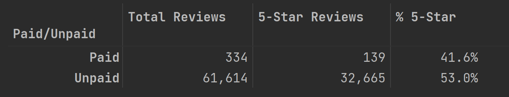

# Amazon Vine Analysis
## Overview
Studying bias in Amazon reviews written by members of the paid Amazon Vine program. 
The Amazon Vine program is a service that allows manufacturers and publishers to receive reviews for their products. 
Companies pay a small fee to Amazon and provide products to Amazon Vine members, who are then required to publish a review.
  
**We want to know:** 
_Are Amazon Vine members more likely to leave 5-star reviews on products they received as part of the program?_
  
**Resources:** 
- [Amazon Review Datasets](https://s3.amazonaws.com/amazon-reviews-pds/tsv/index.txt)
  - _Only examined the "Sports_v1_00.tsv.gz" dataset_

## Results

The table above lists the summary statistics for 5-star reviews from both the Vine program and from regular customers.
  We can use the data to answer some key questions in our study:
- **How many Vine reviews and non-Vine reviews were there?**
  - Of about 62,000 reviews, only 334 were paid for as part of the Vine program, that's just 0.5% of all reviews. This tells us that most reviews are coming from regular customers.
- **How many Vine reviews were 5 stars? How many non-Vine reviews were 5 stars?**
  - Similarly, only 139 Vine reviews rated the product 5-stars, which is just 0.4% of all 5-star reviews.
  - In calculating the percent of all reviews that were part of the Vine program, we have discovered that the paid reviews may be proportionally irrelevant. At such a small fraction of the total, any influence these reviews may have had would be incredibly difficult to spot, but it's still worth examining any potential bias.
- **What percentage of Vine reviews were 5 stars? What percentage of non-Vine reviews were 5 stars?**
  - So how biased were the paid reviews? Not very, according to the table. While over 50% of regular reviews rated a product 5-stars, only 41.6% of paid reviewers did so as well, a surprisingly negative bias for a program that companies may believe improves their product's positioning.
  

## Summary
It would seem the biggest takeaway is that the Vine program is not worth it for most companies. At such a small fraction of all reviews, there is hardly any price worth paying for the seemingly ineffective service, especially when considering the even smaller proportion of 5-star reviews!
  
However, the key word here is _most_ companies. Large companies with a huge share of the market have no need for such a service, 
they have a large enough marketing budget and customer base already, 
and have no need for extra reviews on their products because they are already receiving them. 
But small companies, especially startups, need a bit of help. In fact, these are probably the companies that utilize this service the most, 
because they need people to try their products and offer feedback. 
The wide variation in product quality among small companies and startups would also explain the lesser proportion of 5-star reviews among Vine members, 
as the products they received may not have been quality.
  
It's important to remember that people, especially those who have been compensated, don't usually do things for no reason.
Members of the Vine program tried these products for free, so they had little investment in the success or failure of the good. 
As such, they probably provided more realistic feedback than customers who had a need and shelled out money for a product they hoped could fill it.
That said, I think it would be worth examining the price and number of purchases for each product in the dataset as well, as I postulate most Vine reviews
came from products that were relatively cheap and/or unpopular.